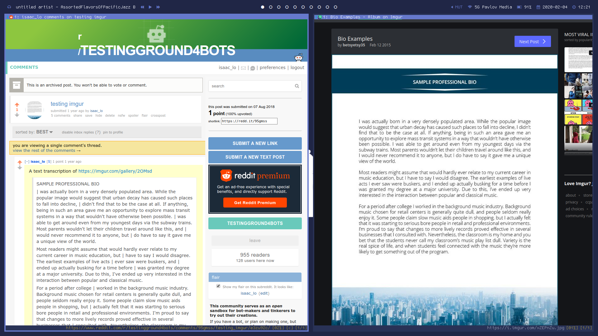

# transcriber_bot

transcriber_bot is a bot that transcribes reddit images

## How to run it

1. Edit the config_default.ini file with the required reddit bot information.
    * debug: If debug is True, the bot will parse images, but not post to reddit
      a test
    * client_id: reddit application client ID
    * client_secret: reddit application client secret
    * user_agent: reddit bot user agent
    * username: reddit username
    * password: reddit password
    * subreddits: list of subreddits to run bot on
2. Rename config_default.ini to config.ini
3. Run transcriber_bot.py.
4. Enjoy!

## How to run tests

1. run ./bin/test.sh
2. That's it. Enjoy!

## What is it

Transcriber_bot is a bot for reddit that transcribes images. The bot scans through subreddits and
to find posts with images. It will then fetch the images, find and format the text within them, and
reply to the image post with any text found within the image. Currently, the bot supports reddit
submissions with static gif, jpg, or png images hosted on reddit media or imgur albums. For imgur
albums, the bot will parse a maximum of 4 album images. Text is formatted by omitting excess
newlines and spaces, and the text replied is limited to a maximum of 5000 characters.

## How does it work

Transcriber_bot is written with Python 3 code and uses a **Pipenv** virtual environment for package
management. **PRAW**, a Python Reddit API wrapper, is used to interface with reddit.
Transcriber_bot uses it to watch subreddits for new posts and send replies. **OpenCV**, a computer
vision library, is used to pre-process images and find sections of text in an image.
**Pytesseract** is a OCR (optical character recognition) library used to recognize and return
characters in images. **Sqlite3** is used as a simple circular log, to ensure that the bot does not
send duplicates of posts if the bot temporarily goes down.

## Why does it exist

I first envisioned the use for the bot when browsing the r/4chan, a subreddit aggregating the
"best" posts of the social media site 4chan, usually in the form of cropped 4chan screenshots.
While the contents of r/4chan weren't exactly to my taste, I noticed something that caught my eye.
Some intrepid users were manually transcribing image text for the convenience of readers. I felt it
was an excellent opportunity for automation, and it served as the impetus for writing
transcriber_bot. Additional applications include helping people on reddit read the contents of
reddit image posts if imgur is blocked, or potentially helping vision-impaired reddit users (using
text-to-speech browsers) read the contents of images.

## Bugs

* Only some imgur albums work. It appears imgur links with "gallery" work
  [https://imgur.com/gallery/2OMsd](https://imgur.com/gallery/2OMsd), but not other links, such as
  [https://imgur.com/a/NyHaeak](https://imgur.com/a/NyHaeak)
